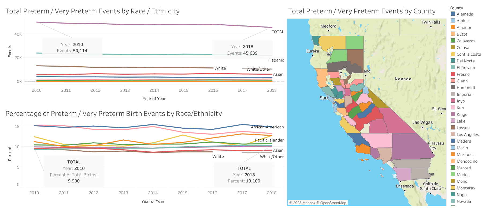

# California Preterm Births 2010-2018

This is a short project.  Initial EDA in Python / Pandas, then I shifted the project to Tableau Public for visualizations.

Still image of end result:

Link to __[Tableau Public](https://public.tableau.com/app/profile/jon.mccaffrey/viz/CaliforniaBirthEvents2010-2018/Dashboard1)__ for additional exploration by race/ethnicity or by each county reporting data (summed over this 9 year period).  

One thing I found interesting:  the total preterm & very preterm birth events __decreased__ from 2010 to 2018, but the __percentage__ of total births that were preterm & very preterm went up slightly in that same time period.  That seems like evidence that the need for continued / additional intervention for maternal health and support for neonates in the NICU will remain strong.  

Thanks for reading!
- Jon

email: jonmccaffrey524@gmail.com  
